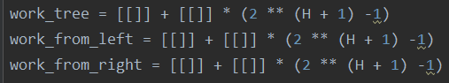
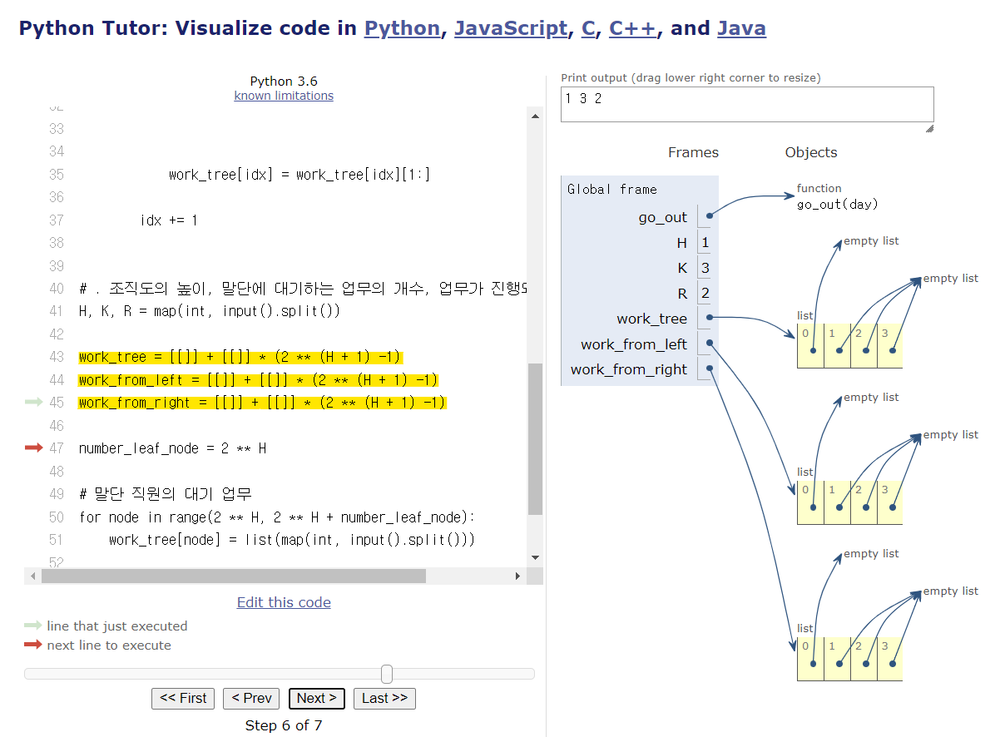
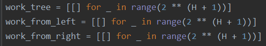
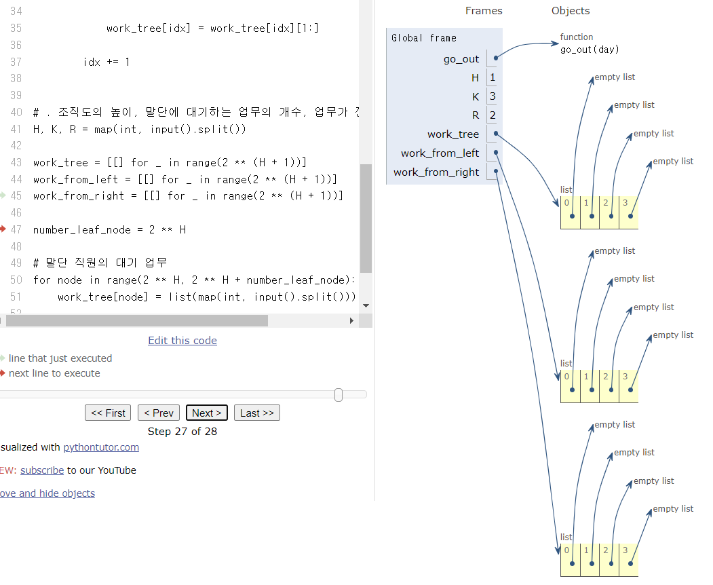

### 문제풀이 결과

1. 실패
2. 성공

### 실패 원인

* 2차원 배열 선언에서의 문제
  * pointer로 모두 같은 빈 배열을 참조하고 있어, 리스트이 한 인덱스에 해당하는 값만 변경했는데 모두가 수정되는 문제가 있었음

* 문제의 코드와 참조 형태

| 코드                                                         | 참조 형태                                                    |
| ------------------------------------------------------------ | ------------------------------------------------------------ |
|  |  |

* 해결 코드와 참조 형태

| 코드                                                         | 참조 형태                                                    |
| ------------------------------------------------------------ | ------------------------------------------------------------ |
|  |  |

### 오늘의 교훈

**빈 2차원 배열의 초기화는 참조의 문제가 있으니, 잘 초기화 하자!**