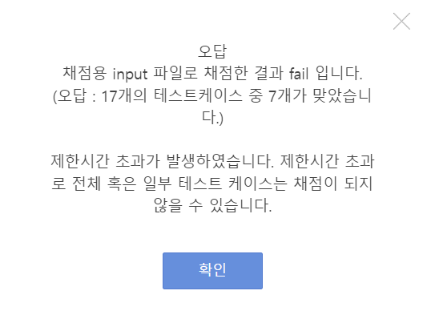
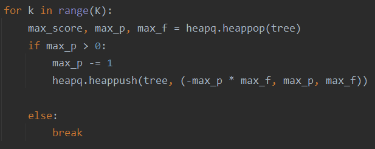
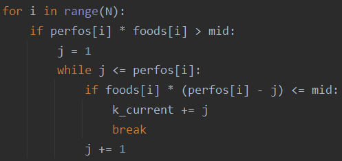
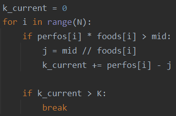

### 문제풀이 결과

1. [priority_q]실패, 제한시간 초과(7/17)
1. [priority_q]실패, 제한시간 초과(7/17)
1. [binary_search]실패, 제한시간 초과(3/17)
1. [binary_search]실패, 제한시간 초과(7/17)
1. [binary_search]성공


### 실패 원인

#### [priority queue]

* 제한시간 초과... heapq로 풀었는데, 너무 손으로 구현한 heapq여서 틀렸을 까요..?
  * 
  * K가 10**18이어서.. 어떻게 하면 좋을지 모르겠군요 흠
* `heapq`를 import해서 풀어도 마찬가지네...


#### 문제를 파악해보자!

* 이 문제의 핵심은 시간초과를 해결하는 것이다.

  * 1 <= `N` <= 200000
  * 0 <= `K` <= 10^18
  * 1 <= `Ai` <= 10^6
  * 1 <= `Fi`<= 10^6

* 그 중에서도 전체 훈련횟수에 해당하는 `K`의 숫자가 매우 커서, 이 아이를 순회하는 코드는 작성하면 안된다. 

* 그런데, priority queue로 작성한 코드에서는 1~`K`까지 순회하면서 훈련을 시키므로 시간초과가 날 수 밖에 없다.

* | 문제의 코드                                                  |
  | ------------------------------------------------------------ |
  |  |

* 훈련횟수를 단번에 계산할 수 있는 이진탐색 코드를 작성해보자!


#### [binary search]

* 로직
  * 이진탐색의 경계값(`left`, `right`, `mid`)은 `max_score`를 기준으로 한다.
  * 이때, `max_score`를 `mid`로 만들기 위한 최소의 훈련 횟수 `k_current`를 구한다.
  * `k_current`가 총 훈련횟수 `K` 이하라면, `mid`는 `max_score`가 될 수 있다.


* 실패한 코드 (제한시간 초과)

```python
left, right = 0, max(점수)
current_max_score = float("inf")
while left <= right:
    mid = (left + right) // 2

    k_current = 0
    for i in range(N):
        if perfos[i] * foods[i] > mid:
            j = 1
            while j <= perfos[i]:
                if foods[i] * (perfos[i] - j) <= mid:
                    k_current += j
                    break
                j += 1

    if k_current > K:
        left = mid + 1
    else:
        if mid < current_max_score:
            current_max_score = mid
        right = mid - 1
```

* 문제점 1) for문을 돌면서 `k_current`가 `K`보다 커진 경우 그냥 종료를 시켜버리면 되는데, 계속 계산을 하고 있다.
* 문제점 2) `K` 즉, 훈련 횟수에 대한 순회를 하지 않기로 했으면서, `perfo[i]`를 줄이는 훈련횟수를 또 순회하고 있었다. `perfo[i]`도 최대 10^6까지 가능하므로 순회를 하지 않는 것이 좋다!


* **코드 비교**

| 실패 코드                                                    | 성공 코드                                                    |
| ------------------------------------------------------------ | ------------------------------------------------------------ |
|  |  |
| while 문으로 훈련횟수를 순회하고 있다                        | 훈련횟수를 계산 1회로 줄여버렸고, <br />k_current가 K보다 큰 경우는 가지치기했다. |


### 오늘의 교훈

**시간 복잡도를 개선하려고 한다면, 순회를 피하고 다른 방식을 찾아야 한다.**

