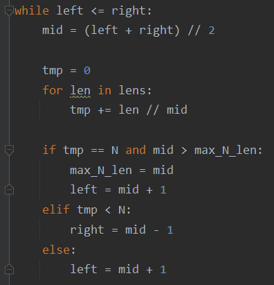

### 문제풀이 결과

1. 실패
2. 성공

### 실패 원인

* 문제를 잘 못 이해했다. 

| 내가 이해한 것                                               | 문제의도                                                     |
| ------------------------------------------------------------ | ------------------------------------------------------------ |
| 전체 막대기를 특정 길이 `mid`로 나눴을 때 생기는 조각 모두를 가지고 N이랑 비교하면 된다고 생각했다. | 그냥 조각 수가 N이 되면 되는 것이므로 `mid`로 나눴을 때 N보다 조각 수가 커져도 무방하다. |
|  |  |

### 오늘의 교훈

**문제의 조건을 꼼꼼히 읽고, 이분탐색에서 찾아내야 할 것을 알아내자!**