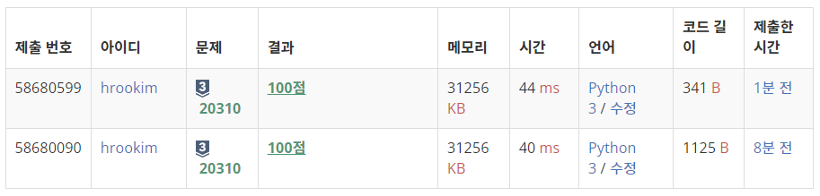

### 문제풀이 결과

1. 성공 (내 코드)
1. 성공 (참고한 코드)

### 실패 원인

* 우선 코드가 길어졌던 이유는, Subtask를 만족시키는 것이 별도의 조건이라고 생각들었기 때문이다. 그래서 Subtask의 조건인지를 판별하는 함수가 있었고, 그런 함수를 실행하고 나서 판별을 하기 때문에 길어질 수 밖에 없었다.
* 사실 어찌되었든 핵심은 `0은 뒤에서부터 지우고, 1은 앞에서부터 지운다`는 것이다.
* 그런데 이것을 지운다는 관점에서 보지 않고, 출력을 한다는 관점에서 보면 훨씬 간단해진다.
* 즉, `0은 앞에서부터 한계 도달 전까지는 출력하고` `1은 한계 도달 전까지는 출력하지 않다가 한계 이상이 되면 출력한다`

### 오늘의 교훈

**관점을 다르게 생각하면 더 간단한 코드가 작성될 것이다!!**