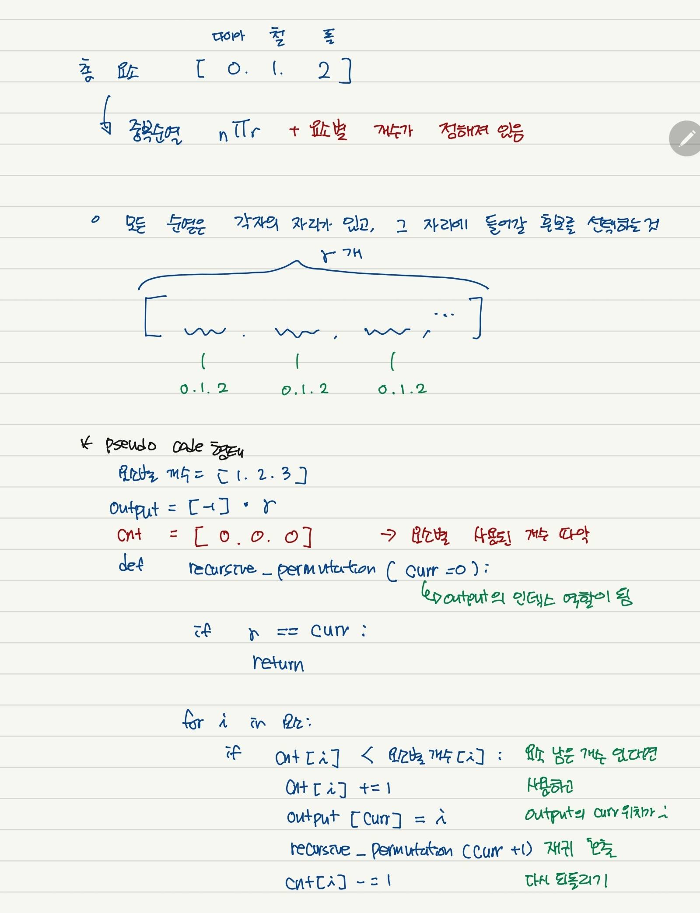

### 문제풀이 결과

1. 실패, 시간초과
2. 성공

### 실패 원인

* 곡괭이의 최대 개수가 15개이고, 광물의 최대 개수가 50개라는 것을 보고, `permutations`를 import해서 사용해도 된다고 생각했다. 그러나 이는 최대 15P10 (일부 중복 요소 제거를 위해 나뉘어 질 수 있으나, 10^4 정도만 줄어든다) 까지 될 수 있다. 심지어 `permutations`에서는 중복 요소를 고려하지 않고 `0`이 1개 `1`이 3개가 있으면 (0, 1)을 세번 내보내기 때문에, `set()`을 사용했음에도 해결이 되지 않았다.
* 그래서 dfs를 사용해서 중복은 제거하여 완전 탐색을 진행했다.
* 중복 요소가 있을 때 순열을 찾는 것은 아래와 같은 로직을 사용할 수 있다.

### 오늘의 교훈

**Recursive에는 많은 연습이 필요하다.. DFS다시 공부하자!**