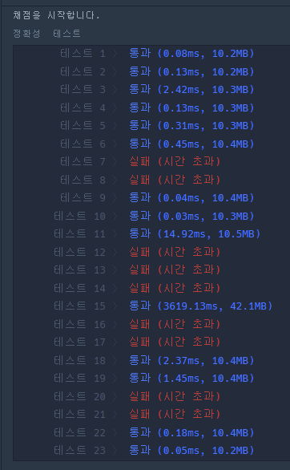
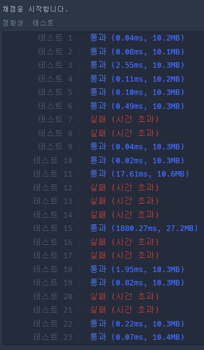
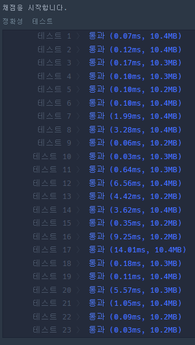

### 문제풀이 결과

| 1. 실패, 시간초과                                            | 2. 실패, 시간초과                                            | 3. 성공                                                      |
| ------------------------------------------------------------ | ------------------------------------------------------------ | ------------------------------------------------------------ |
|  |  |  |

### 실패 원인

1. BFS를 두번 돌리는 것이 과부하가 온 것 같다. L에서 시작을 해서 S, E를 도착점으로 하는 최단시간을 한번의 BFS로 찾으면 되지 않을까?

2. 한번의 BFS로 찾는 것도 실패.. 경로가 길었던 부분만 시간이 줄었고 그외에는 별 차이가 없다.. 이 방법이 아닌가보다ㅠㅜ

3. 앗.. 정답은 너무 간단했다.. 
   우선 굳이 S, L, E의 좌표를 미리 다 알고 있을 필요가 없었다. 이렇게 되면 최대 1만번의 연산이 추가되기 때문이다. 그래서 이번에는 바로 L 좌표를 알게 되면 BFS를 시작하게 코드를 작성했다.

   그리고 시간이 오래걸렸던 가장 큰 문제는 이것이었다. 바로 `visited`를 미리 처리해주지 않아서, queue에서 pop되어서 확인되지 않은 모든 지점들이 queue에 모두 추가되었기 때문이었다.. 세상마상..  

### 오늘의 교훈

**`visited`를 미리 처리하자ㅠㅜ 너무 기본이다 증말**