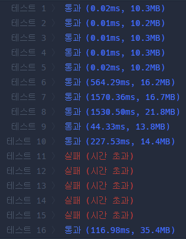
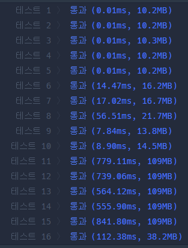

### 문제풀이 결과

1. 실패
2. 성공

| 실패                                                         | 성공                                                         |
| ------------------------------------------------------------ | ------------------------------------------------------------ |
|  |  |

### 실패 원인

* `n`의 크기가 최대 100,000이고, `roads`는 500,000까지 가능하다. 기존에 짰었던 BFS의 경우, 계속 `s`에서 `destination`까지 가는 경로를 찾았다. 그래서 불필요하게 반복해서 찾는 경우가 많았다.
* `destination`에서 모든 노드까지 최단거리를 저장하고, 정답을 도출할 때는 저장된 최단거리를 불러오는 방향으로 해결했다!

### 오늘의 교훈

**input의 크기에 따라 역으로 접근하는 방식을 시도해보자!!**