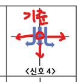
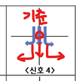
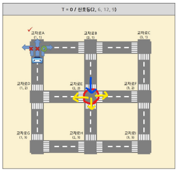
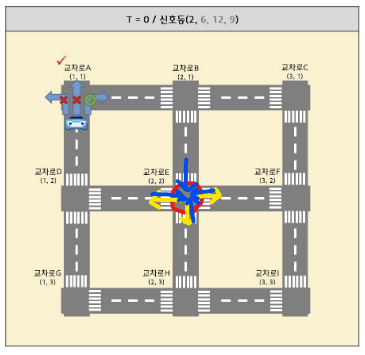
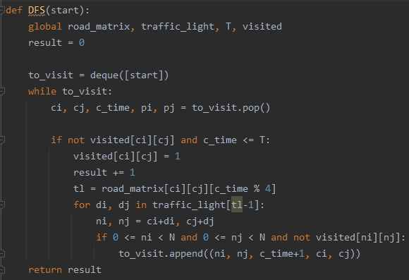
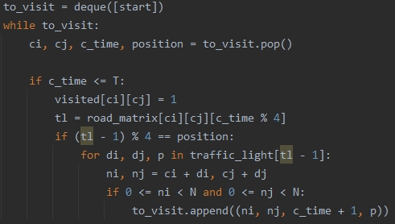
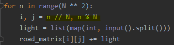
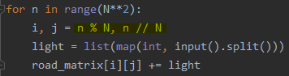
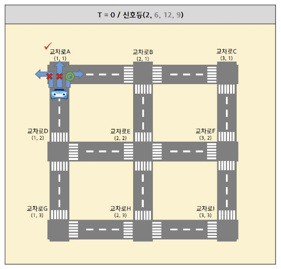

### 문제풀이 결과

1. 실패
2. 실패
3. 실패
4. 실패 (사실상 여기서부터는 로직은 맞았다...)
5. 실패
6. 성공


### 실패 원인

> 1. 문제풀이 결과의 첫번째 시도 -> 개선 
> 2. 문제풀이 결과의 네번째 시도 -> 성공(문제풀이 결과의 여섯번째 시도)

1. **첫 접근에서는 문제를 잘못 이해하고, 로직 또한 틀린 상태였다.**

   * **문제를 잘못 이해한 부분 1)** 교차로에서의 델타 이동

   | 문제의 의도                                                  | 내가 이해한 바 (틀림)                                        |
   | ------------------------------------------------------------ | ------------------------------------------------------------ |
   |  |  |
   | 교차로에 다다랐을 때, 좌/하/우 직진                          | 교차로에 다다랐을 때, 좌회전/우회전, 하 직진                 |
   | di, dj가 `[(0, -1), (1,  0), (0, 1)]`                        | di, dj가 `[(1, -1), (1,  0), (1, 1)]`                        |

   * **문제를 잘못 이해한 부분 2)** 교차로에 진입한 방향에 따라 이동할 수 있는 신호등이 다르다.

   | 문제의 의도                                                  | 내가 이해한 바 (틀림)                                        |
   | ------------------------------------------------------------ | ------------------------------------------------------------ |
   |  |  |
   | 신호등이 허용하는 이동 방향: 노란색<br />파란색 방향으로 와야만 노란색 이동이 가능 | 신호등이 허용하는 이동 방향: 노란색<br />어떤 방향에서 접근했든, 노란색 이동이 가능 |

   		* **로직에서의 틀린 부분 1)** 이미 방문했던 곳은 방문하지 않는 코드

   | 틀린 코드                                                    | 개선 코드                                                    |
   | ------------------------------------------------------------ | ------------------------------------------------------------ |
   |  |  |
   | visited인 지점은 방문하지 않는다. 방문한 교차로 수인`result`가 함수 `DFS()` 안에 존재한다. | visited여부와 상관없이 방문한다. 방문한 교차로 수인`result`는 함수 밖에 존재한다. |
   | 신호에 따른 자동차의 이동이므로 한번 방문했던 곳을 다시 방문할 수 있다!! (심지어 신호가 다르면 다르게 이동도 할 수 있다) | 그러므로 visited 표시를 하되, DFS가 끝나고 난 후 visited를 순회하면서 `result`를 구해주면 된다. |

   * **로직에서의 틀린 부분 2)** 교차로에 진입하는 방향(position)을 고려하지 않은 것

     > 이 부분은 위의 개선코드를 참고하여 설명을 작성한다.

     * stack에 현 교차로 지점의 좌표와 이동시간을 넣는 것에 진입하는 방향 `position`을 추가해서 넣어주었다. 

     * 각 신호등의 이동별 허용 방향이 진입하는 방향과 같은지를 판별하는 코드를 추가한다.

       ```python
       if (tl - 1) % 4 == position:
       ```

       

2. **그리고 최종적으로 문제에서 답이 나오지 않았던 부분은 생각보다 너무 간단했다...**

   | 틀린 코드                                                    | 개선 코드                                                    |
   | ------------------------------------------------------------ | ------------------------------------------------------------ |
   |  |  |

   N**2개의 줄에 걸쳐서 행 우선으로 값을 입력해주고 있는데, i와 j를 반대로 세어버린 것이다.... 뚜둥..
   너무 심각하게 멍청한 부분에서 틀려서 놀랐다....

   > 사실 이렇게 틀린 이유는, 문제에서 자꾸 i, j가 아닌 x, y기준으로 좌표를 설명해서 행/열 혼돈이 있었던 것이고.... 내가 너무 오랜만에 2차원 배열을 풀어서 그렇기도 하다..^^
   > 


### 오늘의 교훈

**졸릴 수 있지만, 문제를 보다 꼼꼼히 이해하고 접근하자!**

**2차원 배열 문제와 탐색 문제를 많이 시도해보자!!!! (너무 오랜만이었다ㅠㅜㅠㅜㅠㅜ)**