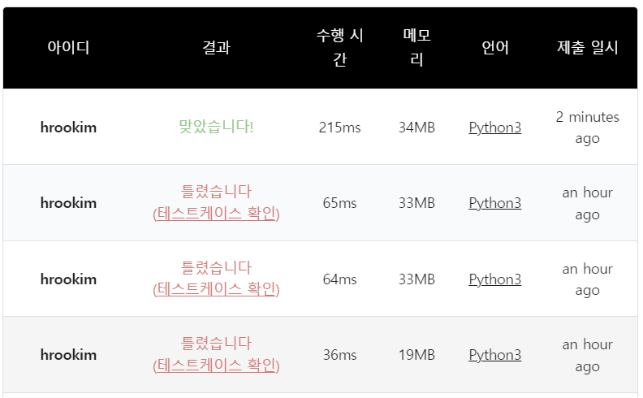
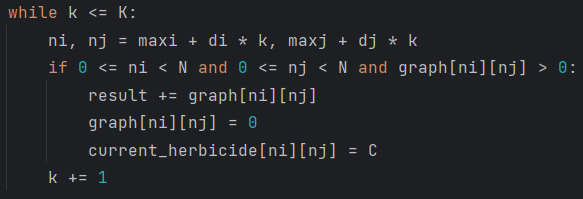
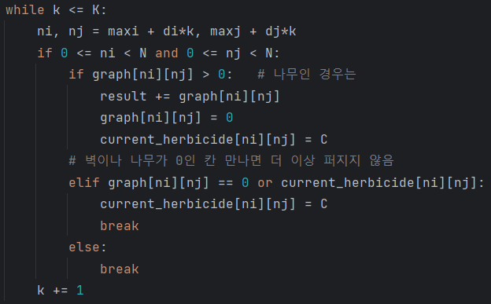
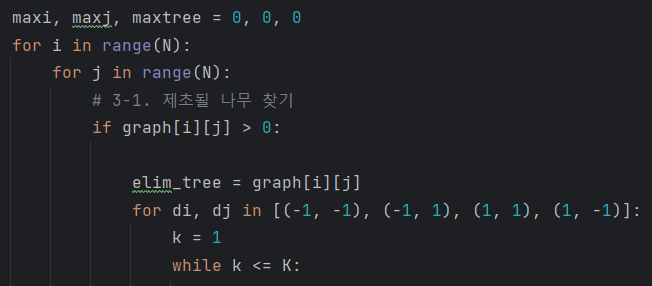
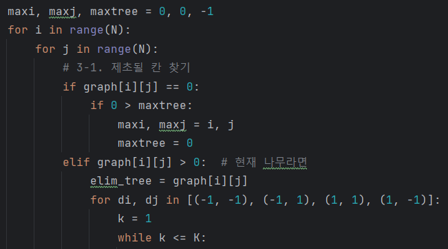

### 문제풀이 결과

1. 실패
2. 실패 (동일 코드 2번 실행)
3. 성공

### 실패 원인

1. 첫번째 시도: **벽이나 나무가 없는 부분을 만나면 제초제 영향은 퍼지지 않는다!**

| before                                                       | after                                                        |
| ------------------------------------------------------------ | ------------------------------------------------------------ |
|  |  |
| 제초제의 영향이 대각선으로 퍼지는 부분에서 나무이기만 한다면 퍼져나갈 수 있게 적힘. 이때는 벽이나 나무가 없으면 그냥 넘어가서 다음 위치에 있는 것을 탐색하게 됨 | 제초제의 영향이 나무에 닿으면 그대로 박멸이 되는 형태이지만, 나무가 없는 곳을 만나게 된다면 단순 제초제 영역 표시를 남기고 `break`, 벽을 만나게 된다면  바로 `break`하여 그 이후를 탐색하지 않음 |

2) 두번째 시도: **나무가 없는 곳에도 제초제가 뿌려질 수 있다!!**

> 이 부분은 테스트케이스를 실행해보니 깨닫게 되었다. 일정 시점 이후부터 나무가 존재하지 않았고 정답에서 단 1 차이가 나는 것이 이상했다.

| before                                                       | after                                                        |
| ------------------------------------------------------------ | ------------------------------------------------------------ |
|  |  |
| 무조건 나무가 있는 경우만 고려하여 제초제가 뿌려질 곳을 판단하였다. | 나무가 없는 칸에도 뿌려질 수 있음을 추가했고, 이때의 `i` `j`로 갱신을 해준다. |
| 틀린 테케의 경우, 나무가 있는 곳이 없었다보니, `maxi` `maxj` 초기값이었던 0, 0에 제초제가 뿌려지고 있었다 |                                                              |

### 오늘의 교훈

**구현 문제에서는 결국 얼마나 디테일을 챙겨서 코드로 구현했는지가 가장 중요하다! 문제의 조건을 꼼꼼히 읽고 빠지는 부분이 없이 코드를 작성하자ㅠㅜ**