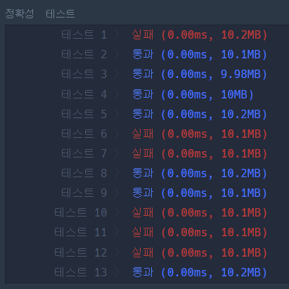

### 문제풀이 결과

1. 실패
   * 

2. 성공

### 실패 원인

* `while`문의 반복 조건이 틀렸당!!!
  * 678이라는 테스트케이스에서 이 실마리를 찾았다. 

|      | Before         | After         |
| ---- | -------------- | ------------- |
| 코드 | while Q >= 10: | while Q >= 1: |

> 이 경우 맨마지막에 Q = 7이 되는데, 이 경우 while문이 동작하지 않고 바로 7을 더해버리게 된다. 가장 마지막의 경우에도 5 이상인지에 따라 계산을 해줘야 한다. 

### 오늘의 교훈

**반복문의 처리 조건을 꼼꼼히 살피자**