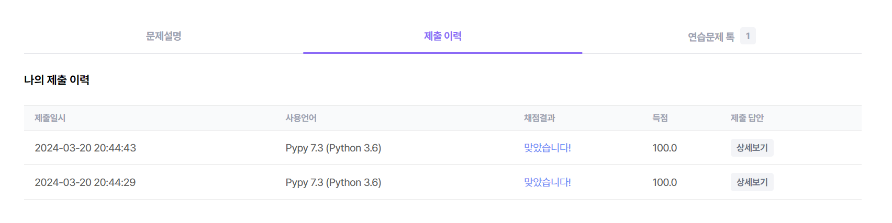

### 문제풀이 결과

1. 성공




### 고려사항

* m의 크기가 크지 않다, 최대 3명의 친구가 있다 + 4칸만 이동을 한다. 
  * 최대 경우의 수로 따졌을 때, 한 사람당 나올 수 있는 최대 이동 경로는 36가지 뿐이다. 
  * 그리고 36 * 36 * 36 개만 따지면 되기 때문에, 전체 경우의 수를 다 돌아서 최대값을 찾는 것이 무조건 가능하다.

* Route의 경우의 수를 찾는 것은 재귀를 통해서 구할 수 있음을 알았지만, 조합은 어떻게 할 것인가?
  * m이 문제마다 다를 수 있으므로 for문을 반복해서 사용할 수 없다. 이럴 때 쓸 수 있는 것이 **재귀**이다. 
  * 이 문제에서는 Route 경우의 수와 친구별 조합 모두 재귀로 풀었다.


* 처음에 2차원 배열이 업데이트가 되지 않고 참고만 되는 상황이 발생해서, 첫 수확 이후 visited 처리된 0이 원래 값으로 돌아오지 않는 문제가 있었다.

  * 2차원 배열의 복사 방법 때문이었는데, 

  * ```python
    ctree = tree_current[:][:]
    # 이 형태는 복사해서 새로 생성을 하지 못한다.
    ```

  * ```python
    ctree = [tree_current[n][:] for _ in range(N)]
    # 이렇게 해야만 제대로 생성이 되었다.
    ```

  * 

  * 위의 방법으로도 복사를 할 수 있다.


### 오늘의 교훈

**재귀에 대한 감이 떨어졌을까봐 걱정했는데, 생각보다 괜찮았다. **

**그래도 아직은 익숙하지 않게 코드를 작성하는 부분이 있어서, 이런 부분을 개선할 필요가 있다.**