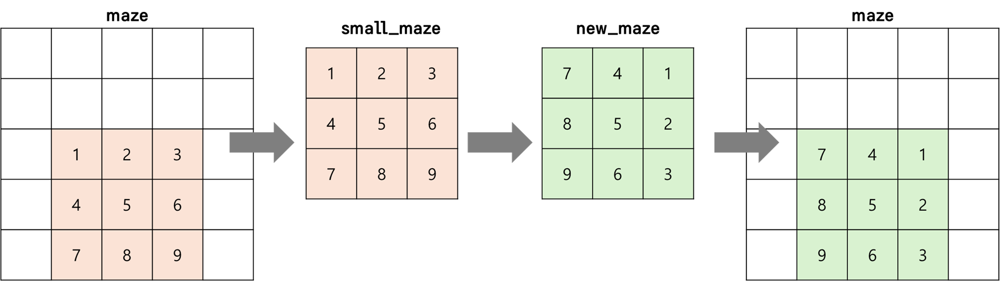

### 문제풀이 결과

> 잔뜩 런타임 에러가 났다가, 정답을 맞히게 되었다!
>
> 세번째 런타임 에러부터는 코드는 맞았는데, `Process exited on signal 11`이라는 이상한 에러가 났다..


### 실패 원인

* 사실 굉장히 총체적 난국이었다. 엣지케이스를 제대로 처리 못한 코드가 많았고, 그래서 디버깅으로 문제를 다시 풀기까지 거의 3시간이 걸렸다. 한 함수 당 고려하는 데 오래 걸렸던 부분을 적어보려 한다.

1. `move_people()`

   * 사람들이 동시에 이동하는 함수다. 나는 `people_distance`라는 queue에 사람의 정보를 관리하고 있었고, 선입선출 방식으로 이동이 가능한지를 확인해서 업데이트 하는 방식으로 코드를 짰다. 

   * 작은 실수로는, pop이 출구에 도착하고 나서는 나서는 m이 증가될 필요가 없었는데 m을 증가해버려서 모든 사람에 대한 이동을 확인하지 못하던 부분도 있었다.

     * ```python
       if [possible_ni, possible_nj] == exit_ij:
           total_moves += 1
           continue
       if maze[possible_ni][possible_nj] == 0:
           total_moves += 1
           m += 1
           people_distance.append([possible_ni, possible_nj])
       ```

     * 그래서 이런식으로 조건에 따른 m의 추가 여부를 추가했다.

   * 큰 로직에서는 틀린 부분이 없었으나, **모든 칸이 이동할 수 없는 칸인 경우는???**에 대한 고려를 하지 못했다. 그리하여, 이동가능한 칸 이라고 적어놓았던 `possible_@@` 변수들이 다 초기값대로 저장되어 버리는 불상사가 발생했다. 

     * 그래서 di, dj를 순회하면서 이동가능성을 평가했는데, 이동할 수 없다면 그대로 `people_distance`에 넣어주는 코드를 두줄 정도 추가하였더니 제대로 해결 되었다.

     * ```python
       if (possible_ni, possible_nj) == (0, 0) and possible_ndist == pdist:
           m += 1
           people_distance.append([pi, pj])
           continue
       ```

2. `find_square()`: 출구와 사용자 최소 1명을 포함한 가장 작은 정사각형을 찾는 함수
   * 다행히도 여기는 로직에서 틀린 것이 없었다. 그래서 다행히도 수정을 하지 않아도 되었다.
   * 여기서 포인트는, 모든 정사각형을 다 그려보는 것이아니라 사람을 돌아가면서(최대 10명) 그 사람을 포함할 수 있는 최소의 정사각형을 찾는 것이다.
   * 정사각형의 한 변의 길이는 `출구i-사람i`과 `출구j-사람j` 값 둘 중 큰 값으로밖에 정해지지 못한다. (물론 같은 경우도 있다) 그래서 각 경우에 따라서 고정되지 않을 쪽을 range 내에서 훑어가는 방식으로 가면 찾을 수 있다 (이건 N이 매우 작기 때문에 무조건 가능한 코드다)
3. `rotate()`: 문제 푼 시간 중 반 이상을 다 여기에만 쏟았을 정도로 나를 정말 힘들게 한 함수다..
   * 처음에는 2차원 배열 중 부분을 회전하는 것이 수식으로 도출할 수 있을 것이라 생각했다. 하지만 이건 크나큰 오산이었다. 펜과 연필 그리고 긴장된 분위기 속에서 이 수식을 빠르게 도출하기는 어렵다. 즉, 다른 식의 접근이 필요했다.
   * 해당 부분의 크기(S)만큼을 따로 2차원 배열로 만들어서 그것을 회전한 후, 들어가야 하는 좌표에 입력을 해주는 것이다.
     * 
     * 이런 형태가 되는데, 여기서 가장 중요한 것은 변하는 사람들의 위치를 잘 갖고 있는 것이다. 난 처음에 **동일 위치에 여러명이 있을 때를 캐치하지 못해서 한 사람만 위치가 변경되게 만들어 버렸다**.. ㅠㅜ 이거 해결하는데 진짜 오래 걸렸다.
       * 내가 도입한 방법으로는 `small_maze`에서 `new_maze`로 옮길 때 단순히 90도로 회전해서 변경된 값을 넣는 것이 아니라, [값, 원래i, 원래j]를 넣는 것이었다.
       * 그리고 people_distance를 돌면서 new_maze에 저장된 원래ij와 pi, pj동일하다면 그 people의 위치를 i+r, j+c로 업데이트 시켜주는 것이다


### 오늘의 교훈

**엣지케이스를 고려하는 능력이 많이 죽었다.. 심각하게 죽었다..ㅠㅜ 진짜 코드를 짤 때 한번씩 더 고민을 해야 하는데 그것이 너무 부족하다. 앞으로 남은 기간동안 더 열심히 연습을 해야 할 것 같다**