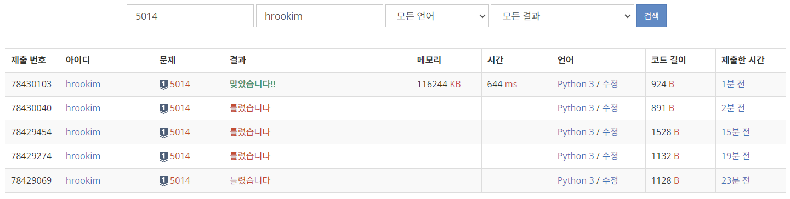

### 문제풀이 결과



1. 실패 * 3
2. 실패 [여기서부터 BFS 사용]
3. 성공


### 실패 원인

* 1번 실패의 원인은 이 문제의 접근을 BFS라고 생각하지 못한 탓에 있다.. 
  * U와 D의 조합으로 S->G가 가능할 것이라는 생각을 해서, `S + n*U -m*D == G`이런 등식이 성립할 것이라 예상했던 것이다. 
  * 하지만 이 식은 통하지 않았다.. 아예 1%도 제대로 이동을 하지 못했다. 

* 질문 게시판을 통해서 BFS로 풀 수 있다는 힌트를 얻고 생각을 해보았다.
  * 나는 BFS를 통해서 최단 거리를 찾을 때 이동하는 경우마다 visited가 다른데 어떡하지 라는 고민을 한 적이 있다.
    * 그런데 이 고민은 사실 말이 안되는 것이다.
    * 이미 BFS로 이동을 하는 것 자체가, 해당 칸에 최단 거리로 이동을 하는 경우이기 때문이다. 그리고 해당 칸에 도달해서 그 칸에서 이동할 수 있는 경로를 찾기 때문에 경로가 끊기면 어떡하지 라는 고민을 할 필요가 없는 것이다 허허!

  * 암튼, 그래서 코드를 수정한 결과는 다음과 같은 로직을 가지고 있다.


```python
def BFS(S, G, U, D):
    
    visited = dict()	# 최고층이 커질 수 있는데, 그 크기만큼의 배열을 선언하는 것은 불필요하다
    visited[S] = 1		# 이렇게 방문을 체크
    
    to_visit = deque([(S, 0)])	# 현재 위치와 이동한 거리
    
    while to_visit:
        cstair, cmove
        
        nstair = cstair + U / cstair - D  # 이렇게 두개가 가능할 것
        
        # nstair가 1 ~ F 안에 들면서 방문한 적이 없다면 가자!
        if ~~
        
        	# 갔는데 내가 도달해야할 G라면 cmove+1만큼을 프린트하고 return
            
            # G가 아니라면, visited처리를 하고 queue에 추가하고 다음턴!
                    
```


### 오늘의 교훈

**이 문제를 풀 때 BFS가 사용될 것이라는 아이디어를 떠올리지 못했다.. 많은 문제 연습 필요할 것 같다ㅜㅠ**