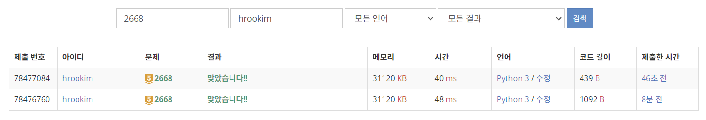

### 문제풀이 결과

1. 성공
2. 성공 (DFS)

### 개선점

* 나는 거의 그래프 탐색의 아주 초기급으로 풀었고 그 덕분에 코드가 1092B나 차지하게 되었다.
* 그런데 이 문제는 순환을 하면 되는 것이기 때문에, DFS를 통해서 start 지점으로만 돌아오면 되는 것이었다 허허
* 그리고 내 코드는 순환이 될 수 있는 아이들을 모두 넣어서 중복을 제거하게 되는데, 이 경우는 시작해서 순환으로 돌아올 수 있으면 그 시작점만 넣는 것이기 때문에 나중에 중복을 제거할 필요가 없다! 이 부분도 참 깔끔했던 부분 같다

### 오늘의 교훈

**BFS, DFS를 2차원이 아닌 상태에서도 사용할 수 있다는 것을 잊지말자!!!**